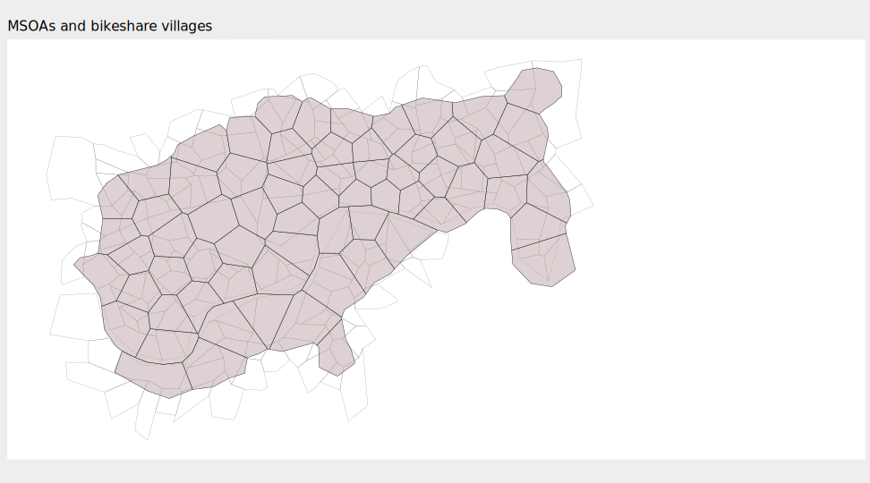

## Introduction

This document describes code that underpins the applied data analysis detailed in the paper.

Please cite:

Beecham, R., Yang, Y., Tait, C. and Lovelace, R. _Connected bikeability in London: which localities are better connected by bike and does this matter?_. DOI: []().

## Setup

### Required libraries

Required packages can be installed individually with `install.packages(<package_name>)`. Core packages are imported into the session with `library(<package_name>)`. Occasional use of packages is made with the `<package-name>::<function-name>()` syntax so as to avoid polluting the workspace.

```{r, load-packages, eval=FALSE}
pkgs <- c("tidyverse","sf", "here", "rmapshaper")
# If not already installed.
# install.packages(pkgs)
# Core packages
library(tidyverse)              # Bundle of packages for data manipulation.
library(sf)                     # For working with geospatial data.

# ggplot theme for paper
source(here("code","theme_paper.R"))
```

## Load Census OD data

The data analysis aims to explore how well London's cycle facilities, and the trips it supports as quantified by connected bikeability, meet the needs of its occupants. To do this we use 2011 Census OD commute data, disaggregating OD commutes according to occupation type.  Data are released at middle layer super output area level (MSOA) -- [UK Data Service](https://www.ukdataservice.ac.uk) Table WU07AUK. Additionally, we load a boundary file for MSOAs from [ONS Open Geography](https://geoportal.statistics.gov.uk/search?collection=Dataset&sort=name&tags=all(BDY_MSOA%2CDEC_2011)).

```{r, load-census, eval=FALSE}
# Origin-Desination data by occupation published via UK Data Service.
commute_data  <- read_csv(here("data", "wicid_output_occupation.csv"))

# MSOA boundary data (from https://geoportal.statistics.gov.uk/s)
# Simplified using rmapshaper
msoa_boundaries <- st_read(here("data", "msoa_boundaries.geojson"))
# Filter on all MSOAs within London.
region_boundaries <- st_read(here("data", "regions.geojson")) %>%
  filter(RGN20NM=="London")
temp <- msoa_boundaries %>% st_filter(region_boundaries %>% select(RGN20NM))
# Not very simplified as City of London in so small.
temp <- temp %>% rmapshaper::ms_simplify(keep=.1)
# Cast to OSGB.
temp <- temp %>% st_transform(crs=27700)
```

## Match MSOAs with bikeshare villages



Next we identify all MSOAs that intersect with the LCHS boundary and filter the commute data on these MSOAs, both origin and destination.

```{r, match-msoas, eval=FALSE}
# Read in villages.
geid_real_sf <- st_read(here("data","grid_real_sf.geojson"))

# Buffer around bikeshare scheme villages.
temp_buffer <- grid_real_sf %>% filter(type=="real") %>%
  st_buffer(dist=0, .predictate=st_intersects) %>%
  summarise()
temp_filtered <- temp  %>% st_filter(temp_buffer, .predictate=st_intersects())

ggplot() +
  geom_sf(data=temp_filtered, colour="#737373", size=.1, fill="transparent") +
  geom_sf(data=temp_buffer, colour="#252525", fill="#67000d", size=0, alpha=.2)+
  geom_sf(data=grid_real_sf %>% filter(type=="real"), colour="#252525", fill="#d9d9d9", size=.2, alpha=.4)+
  labs(title="MSOAs allocated to villages")

# Filter all Census msoas with origins *and* destinations within the buffer.
commute_data_filtered <- commute_data %>%
    rowwise() %>%
    mutate(
      all_jobs=sum(all),
           prof_jobs=sum(`1_managers_senior`,`2_professional`, `3_associate_professional`, na.rm=TRUE),
           non_prof_jobs=all-prof_jobs) %>%
    ungroup() %>%
    select(origin_msoa, destination_msoa, prof_jobs, non_prof_jobs) %>%
    filter(
      origin_msoa %in% (temp_filtered %>% pull(MSOA11CD)) &
        destination_msoa %in% (temp_filtered %>% pull(MSOA11CD))
      )
```  

## Assign individual commutes to villages

The two geographies, MSOAs and villages, intersect in many different ways and cannot be easily reconciled. Our solution is to generate individual records for each commute -- e.g. to detach commutes from their aggregated MSOA-MSOA geography. For each observation (commuter record) we generate estimated point locations by random spatial sampling within the polygon area of that commute’s origin and destination MSOA. These estimated point locations are then used to assign commute origin and destination locations to the bikeshare villages in which they are contained.

We define a function for the random spatial sampling, using [`st_sample`](https://r-spatial.github.io/sf/reference/st_sample.html).

```{r, geo-sample, eval=FALSE}
#' Random spatial sample within polygon.
#'
#'
#' @param geo An sf MULTIPOLYGON object.
#' @param n Desired sample size.
#'
#' @return A tidy data frame (tibble) with ST_POINT geometry defining point locations.
#'
#' @export
geo_sample <- function(geo, n) {
  return(
    sf::st_sample(x=geo, size=n) %>%
    st_coordinates()
  )
}
```

We then generate a large set ($n=2000$) of sampled points for each MSOA, held in `sampled_msoas`.

```{r, sample-msoas, eval=FALSE}

# For quick searching, generate sampled point locations for each MSOA.
# Resample from these locations to then generate origin and destination points
# for each commute.
sampled_msoas <- temp_filtered %>% select(msoa=MSOA11CD) %>%
  nest(data=-c(msoa)) %>%
  mutate(
    sampled_points=map(data,~geo_sample(geo=.x,n=2000) %>%
                     as_tibble(.name_repair=~c("east", "north"))
    )
  ) %>%
  unnest(-data) %>%
  select(-data)
```
For each commute we then search in `sampled_msoas` to attach point locations -- and do this separately for professional and non-professional commutes. This is achieved by taking each MSOA-MSOA OD pair and sampling MSOA point locations by origin and destination according to the commute count (`non_prof_jobs` / `prof_jobs`) of that OD pair.


```{r, sample-commutes, eval=FALSE}
# Generate points for non-profs.
non_prof_points <- commute_data_filtered %>% mutate(od_pair=paste0(origin_msoa,"-",destination_msoa)) %>%
  filter(non_prof_jobs>0) %>%
  nest(data=-c(od_pair)) %>%
  mutate(
    o_non_prof=map(
      data,
      ~sample_n(
        sampled_msoas %>% filter(msoa==.x %>% pull(origin_msoa)),
        size=.x %>% pull(non_prof_jobs)
        ) %>%
      as_tibble(.name_repair=~c("o_msoa","o_east", "o_north"))
    ),
   d_non_prof=map(
     data,
     ~sample_n(
       sampled_msoas %>% filter(msoa==.x %>% pull(destination_msoa)),
       size=.x %>% pull(non_prof_jobs)
       ) %>%
      as_tibble(.name_repair=~c("d_msoa","d_east", "d_north"))
   ),
  ) %>%
  unnest(-data) %>%
  select(-data)

prof_points <- commute_data_filtered %>% mutate(od_pair=paste0(origin_msoa,"-",destination_msoa)) %>%
  filter(prof_jobs>0) %>%
  nest(data=-c(od_pair)) %>%
  mutate(
    o_non_prof=map(
      data,
      ~sample_n(
        sampled_msoas %>% filter(msoa==.x %>% pull(origin_msoa)),
        size=.x %>% pull(prof_jobs)
      ) %>%
        as_tibble(.name_repair=~c("o_msoa","o_east", "o_north"))
    ),
    d_non_prof=map(
      data,
      ~sample_n(
        sampled_msoas %>% filter(msoa==.x %>% pull(destination_msoa)),
        size=.x %>% pull(prof_jobs)
      ) %>%
        as_tibble(.name_repair=~c("d_msoa","d_east", "d_north"))
    ),
  ) %>%
  unnest(-data) %>%
  select(-data)
```

Finally, commutes are assigned to the bikeshare village in which they are contained using [`st_join`](https://r-spatial.github.io/sf/reference/st_join.html), and we then summarise over village-village OD pairs.

```{r, assign-commutes, eval=FALSE}
ods_non_prof  <- non_prof_points %>% select(-c(od_pair,o_msoa, d_msoa)) %>%
  st_as_sf(coords=c("o_east", "o_north"), crs=27700) %>%
  st_join(grid_real_sf %>% filter(type=="real") %>%  select(o_village=name), .predicate=st_intersects()) %>%
  st_drop_geometry() %>%
  st_as_sf(coords=c("d_east", "d_north"), crs=27700) %>%
  st_join(grid_real_sf %>% filter(type=="real") %>%  select(d_village=name), .predicate=st_intersects())  %>%
  st_drop_geometry() %>%
  filter(!is.na(o_village) & !is.na(d_village)) %>%
  group_by(o_village, d_village) %>%
  summarise(count=n())


ods_prof <- prof_points %>% select(-c(od_pair,o_msoa, d_msoa)) %>%
  st_as_sf(coords=c("o_east", "o_north"), crs=27700) %>%
  st_join(grid_real_sf %>% filter(type=="real") %>%  select(o_village=name), .predicate=st_intersects()) %>%
  st_drop_geometry() %>%
  st_as_sf(coords=c("d_east", "d_north"), crs=27700) %>%
  st_join(grid_real_sf %>% filter(type=="real") %>%  select(d_village=name), .predicate=st_intersects())  %>%
  st_drop_geometry() %>%
  filter(!is.na(o_village) & !is.na(d_village)) %>%
  group_by(o_village, d_village) %>%
  summarise(count=n())
```
