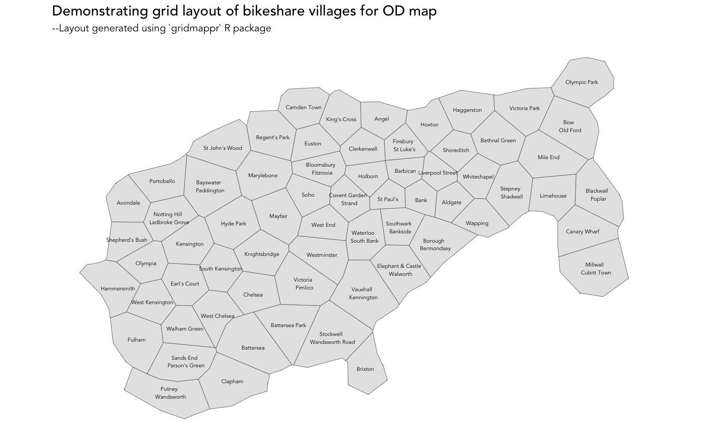

## Introduction

This document describes how bikeshare villages -- the spatial unit of analysis customised for connected bikeability  -- was generated.

Please cite:

Beecham, R., Yang, Y., Tait, C. and Lovelace, R. (2023) "Connected bikeability in London: which localities are better connected by bike and does this matter?", *Environment & Planning B: Urban Analytics and City Science*. DOI: [osf.io/gbfz8](https://osf.io/gbfz8).

## Setup

### Required libraries

Required packages can be installed individually with `install.packages(<package_name>)`. Core packages are imported into the session with `library(<package_name>)`. Occasional use of packages is made with the `<package-name>::<function-name>()` syntax so as to avoid polluting the workspace.

```{r, load-packages, eval=FALSE}
pkgs <- c("tidyverse","sf", "here", "gganimate")
# If not already installed.
# install.packages(pkgs)
# Core packages
library(tidyverse)              
library(sf)                     

# ggplot theme for paper
source(here("code","theme_paper.R"))
```

## Load villages from [jwoLondon](https://github.com/jwoLondon/mobv/blob/master/data/london/geo/localities.json)

To analyse changes in London bikeshare use pre, during and after Covid-19 restrictions, Jo Wood and colleagues created 84 bikeshare 'villages' -- labelled neighbourhoods which, assuming some familiarity with central London, are reasonably coherent and discriminating. We borrow these villages, but merge several to reduce the total number to 66.

First load villages and their corresponding centroids from [github.com/jwoLondon/mobv](https://github.com/jwoLondon/mobv).

```{r, load-localities, eval=FALSE}
# Localities from https://github.com/jwoLondon/mobv.
localities <- st_read(here("data", "localities.geojson"), crs=27700) |> 
  left_join(read_csv(here("data", "locality_centroids.csv")) |>  select(name, region))

locality_centroids <- read_csv(here("data", "locality_centroids.csv")) |> 
  st_as_sf(coords=c("lon","lat"), crs=4326) |> 
  st_transform(crs=27700) |> 
  st_coordinates() |> 
  as_tibble() |> 
  bind_cols(localities |>  st_drop_geometry() |>  select(name, region)) |> 
  rename(easting=X, northing=Y) |> 
  relocate(name, .before=easting)
```


## Aggregate [jwoLondon](https://github.com/jwoLondon/mobv/blob/master/data/london/geo/localities.json) villages

Then we manually aggregate selected localities and create new centroids for those aggregated localities. Code hidden for brevity, but can be viewed in [generate-villages.Rmd](generate-villages.Rmd).

```{r, aggregate-localities, eval=FALSE, echo=FALSE}
localities_agg <- locality_centroids |> 
  mutate(name_agg = case_when(
    name == "Putney" ~ "Putney | Wandsworth",
    name == "Wandsworth" ~ "Putney | Wandsworth",
    name == "Wandsworth Road" ~ "Stockwell | Wandsworth Road",
    name == "Stockwell" ~ "Stockwell | Wandsworth Road",
    name == "Vauxhall" ~ "Vauxhall | Kennington",
    name == "Kennington" ~ "Vauxhall | Kennington",
    name ==  "Elephant & Castle" ~ "Elephant & Castle | Walworth",
    name ==  "Borough" ~ "Borough | Bermondsey",
    name ==  "Bermondsey" ~ "Borough | Bermondsey",
    name ==  "Walworth" ~ "Elephant & Castle | Walworth",
    name ==  "Waterloo" ~ "Waterloo | South Bank",
    name ==  "South Bank" ~ "Waterloo | South Bank",
    name ==  "Southwark" ~ "Southwark | Bankside",
    name ==  "Bankside" ~ "Southwark | Bankside",
    name ==  "Millwall" ~ "Millwall | Cubitt Town",
    name ==  "Cubitt Town" ~ "Millwall | Cubitt Town",
    name ==  "Blackwall" ~ "Blackwall | Poplar",
    name ==  "Poplar" ~ "Blackwall | Poplar",
    name ==  "Bow" ~ "Bow | Old Ford",
    name ==  "Old Ford" ~ "Bow | Old Ford",
    name ==  "Stepney" ~ "Stepney | Shadwell",
    name ==  "Shadwell" ~ "Stepney | Shadwell",
    name ==  "Finsbury" ~ "Finsbury | St Luke's",
    name ==  "St Luke's" ~ "Finsbury | St Luke's",
    name ==  "Covent Garden" ~ "Covent Garden | Strand",
    name ==  "Strand" ~ "Covent Garden | Strand",
    name == "Bloomsbury" ~ "Bloomsbury | Fitzrovia",
    name == "Fitzrovia" ~ "Bloomsbury | Fitzrovia",
    name == "Bayswater" ~ "Bayswater | Paddington",
    name == "Paddington" ~ "Bayswater | Paddington",
    name == "Notting Hill" ~ "Notting Hill | Ladbroke Grove",
    name == "Ladbroke Grove" ~ "Notting Hill | Ladbroke Grove",
    name == "Sands End" ~ "Sands End | Parson's Green",
    name == "Parson's Green" ~ "Sands End | Parson's Green",
    name == "Victoria" ~ "Victoria | Pimlico",
    name == "Pimlico" ~ "Victoria | Pimlico",
    TRUE ~ name
  )) |> 
  group_by(name_agg) |> 
  summarise(easting=mean(easting), northing=mean(northing), region=first(region))
```

Next we create a voronoi tessellation around our new localities.

```{r, aggregate-tessellation, eval=FALSE}
# Define outline of original localities in order to clip Voronoi.
localities_outline <- localities |>  st_buffer(dist=50, .predictate=st_intersects) |> 
  summarise()
# Voronoi tessellation on new points.
v <- st_voronoi(st_union(localities_agg |> st_as_sf(coords=c("easting","northing"), crs=27700)),
                localities_outline$geometry)


# Clip Voronoi, extract centroids and write to file.
v <- st_intersection(st_cast(v), st_union(localities_outline)) |> 
  as_tibble() |>  st_as_sf() |> 
  st_join(
    localities_agg |>  st_as_sf(coords=c("easting","northing"), crs=27700)
    )
v_centroids <- v |>  st_centroid() |>  st_coordinates() |>  as_tibble() |> 
    rename(easting=X, northing=Y)
v <- v |>  bind_cols(v_centroids)
st_write(v, here("data", "villages_agg.geojson"))
rm(v)
```

Localities (now termed *villages*) were then manually edited in QGIS to address issues such as villages crossing the river or localities on the edge of scheme missing docking stations on the scheme boundary.

```{r, load-fixed-villages, eval=FALSE}
villages <- st_read(here("data", "villages_agg_extent.geojson"))
```

The semi-spatial grid-layout of villages used in the paper was generating using the web-tool published alongside [Meulemans et al. 2017](https://www.gicentre.net/small-multiples-with-gaps). This can now be achieved using the [`gridmappr`](https://github.com/rogerbeecham/gridmappr) R package.

```{r, generate-grid-villages, eval=FALSE}
devtools::install_github("gridmappr")
library(gridmappr)
# Make sf grid object over localities.
n_row <- 10
n_col <- 13
pts <- villages |> st_drop_geometry() |> select(name_agg, x=easting, y=northing)
solution <- points_to_grid(pts, n_row, n_col, .6)
villages_grid <- make_grid(villages, n_row, n_col) |> inner_join(solution) 
```

## Plot villages


The two geographies -- semi-spatial grid and real -- are merged to a single dataset and written out to file, also to explore displacement using `gganimate`.

```{r, write-villages, eval=FALSE}
# Calculate real centroids for relabelling.
villages <- villages |>
  left_join(solution) |> 
  select(col, row, x=easting, y=northing, name_agg)

grid_real <- bind_rows(
  villages |> arrange(name_agg) |>  mutate(type="real", id=row_number()) |>  arrange(id), 
  villages_grid |> arrange(name_agg) |>  rename(geometry=geom) |> mutate(type="grid", id=row_number()) |>  arrange(id) 
  ) |> 
  mutate(type=fct_relevel(as_factor(type), "real","grid"))
  
# Write out.
st_write(grid_real, here("data", "grid_real_sf.geojson"))

# Show displacement by morphing between layouts.
displacement <- grid_real |> 
  ggplot()+
  geom_sf(colour="#616161", size=0.15)+
  coord_sf(crs=27700, datum=NA)+
  geom_text(aes(x=x, y=y, label= gsub("*\\|.", "\n ", name_agg)),
             size=2.1, alpha=1, show.legend=FALSE, family="Avenir Book", colour="#000000")+
  gganimate::transition_states(type, 1, 2)+
  labs(title="Demonstrating grid layout of bikeshare villages for OD map",
        subtitle="--Layout generated using `gridmappr` R package")+
  theme(axis.title.x=element_blank(), axis.title.y=element_blank())

gganimate::animate(
  displacement, duration=5, fps=10, width=1600, height=1000, res=150,
  renderer=gganimate::gifski_renderer(here("figs", "anim_real_grid.gif"))
)
```

## OD maps

We generate estimates of bikeability for journeys made between all bikeshare villages -- up to $66^2$ (4,326) OD village-village pairs. Although the bikeshare villages offer a degree of aggregation, inferring geographic structure with this number of pairs using  *de facto* flow visualizations is challenging. Problems of clutter and salience bias hinder meaningful analysis. OD maps are one alternative ([Wood et al. 2010](https://www.tandfonline.com/doi/abs/10.1179/000870410X12658023467367)). They are essentially origin-destination matrices, but where the cells are given a two-level geographic
arrangement using a map-within-map layout.


In our implementation the large grid squares are bikeshare villages with an approximate geographic arrangement, and each represents a trip *destination*. Embedded in every larger cell is a map of bikeshare origins. The origin maps are then shaded according to a quantity of interest -- bikeability scores in the maps below. This means that each village–village OD pair is roughly equally
visually salient, allowing detailed patterns in connected bikeability to be analysed concurrently.


```{r, map-map, eval=FALSE, echo=FALSE}
# Fix some labelling problems.
grid_real <- grid_real %>% rename(name=name_agg) |> 
  mutate(
    name=case_when(
      name=="Waltham Green | West Chelsea" ~ "West Chelsea",
      name=="Elephant & Castle | Walworth" ~ "Walworth | Elephant & Castle",
      name=="Covent Garden | Strand" ~ "Strand | Covent Garden",
      name=="Bloomsbury | Fitzrovia" ~ "Fitzrovia | Bloomsbury",
      name=="Southwark | Bankside" ~ "Bankside | Southwark",
      name=="Blackwell | Poplar" ~ "Poplar | Blackwell",
      TRUE ~ name
    )
  )

rivers <- st_read(here("data", "river_buffer.geojson"))

# Temporary plot object of data -- grid-within-grid.
temp_ods <- grid_real |> filter(type=="real") |>  st_drop_geometry() |> 
  select(destination=name) 
temp_ods <- temp_ods |> 
  mutate(origin=list(temp_ods %>% pull(destination))) |> 
  unnest(cols=origin)

plot_data_temp <- grid_real %>% filter(type=="real") |> 
  rename(origin=name, o_x=x, o_y=y) %>% select(-c(col, row)) |> 
  right_join(temp_ods, by=c("origin"="origin")) |> 
  left_join(grid_real |> filter(type=="real") |>  st_drop_geometry() |> 
              select(name,x,y, col, row), by=c("destination"="name")) |> 
  rename(d_x=col, d_y=row)

# Identify locality in focus (edit this to switch between D-OD and O-DO matrix).
plot_data_temp <- plot_data_temp |>  mutate(label=if_else(origin==destination,destination,""),
                                            focus=if_else(origin==destination,1,0))

# Rivers.
temp <- plot_data_temp |> filter(focus==1) |> st_drop_geometry() |> 
  mutate(geometry=rivers$geometry) |> 
  st_as_sf(sf_column_name = "geometry")

bbox_grid <- st_bbox(grid_real |>  filter(type=="real"))
box_width <- bbox_grid$xmax-bbox_grid$xmin
box_height <- bbox_grid$ymax-bbox_grid$ymin

plot <- 
  plot_data_temp |>
  ggplot()+
   geom_sf(data=. %>% group_by(destination) %>%
             summarise(d_y=first(d_y), d_x=first(d_x)), colour="#616161", size=0.2)+
  geom_sf(colour="#616161", size=0.05)+
  geom_sf(data=.  %>% filter(focus==1), fill="white",  colour="#373737", size=0.05)+
  geom_text(data=. %>% filter(focus==1),
            aes(x=x, y=y, label=str_sub(label,1,1)), family="Avenir Book",
            colour="#000000", alpha=1, size=1.5, show.legend=FALSE,
            hjust="centre", vjust="middle")+
  geom_text(data=. %>% filter(focus==1),
            aes(x=bbox_grid$xmax, y=bbox_grid$ymin, label=gsub("*\\|.", "\n ", label)),
            family="Avenir Book", colour="#000000", alpha=1, size=1.8, show.legend=FALSE,
            hjust="right", vjust="bottom")+
  geom_sf(data=temp, size=0.15)+
  coord_sf(crs=st_crs(plot_data_temp), datum=NA)+
  labs(title="Map-within-map layout") +
  facet_grid(-d_y~d_x, shrink=FALSE)+
  theme(
    panel.spacing=unit(0.1, "lines"),
    axis.title.x=element_blank(),axis.title.y=element_blank(),
    strip.text.x = element_blank(), strip.text.y = element_blank(),
    plot.title = element_text(size = 14),
    panel.background = element_rect(fill="#ffffff", colour="#ffffff"),
    plot.background = element_rect(fill="#eeeeee", colour = NA)
  )
ggsave(here("figs", "map_map.svg"), plot=plot,width=13.5, height=7.2)
```


```{r, od-map-index, eval=FALSE, echo=FALSE}
# Association with commuter counts.
bikeability <- read_csv(here("data","simulated_data.csv")) |> 
  group_by(o_village, d_village) |> 
  summarise(index=mean(index))
# Fix some labelling problems.

bikeability <- bikeability |> 
  mutate(
    o_village=case_when(
      o_village=="Waltham Green | West Chelsea" ~ "West Chelsea",
      o_village=="Elephant & Castle | Walworth" ~ "Walworth | Elephant & Castle",
      o_village=="Covent Garden | Strand" ~ "Strand | Covent Garden",
      o_village=="Bloomsbury | Fitzrovia" ~ "Fitzrovia | Bloomsbury",
      o_village=="Southwark | Bankside" ~ "Bankside | Southwark",
      o_village=="Blackwell | Poplar" ~ "Poplar | Blackwell",
      TRUE ~ o_village
    ),
    d_village=case_when(
      d_village=="Waltham Green | West Chelsea" ~ "West Chelsea",
      d_village=="Elephant & Castle | Walworth" ~ "Walworth | Elephant & Castle",
      d_village=="Covent Garden | Strand" ~ "Strand | Covent Garden",
      d_village=="Bloomsbury | Fitzrovia" ~ "Fitzrovia | Bloomsbury",
      d_village=="Southwark | Bankside" ~ "Bankside | Southwark",
      d_village=="Blackwell | Poplar" ~ "Poplar | Blackwell",
      TRUE ~ d_village
    )
  )

plot_data_temp <- grid_real |>  filter(type=="real") |>  select(-c(col,row)) |> 
    right_join(temp_ods |> rename(d_village=destination, o_village=origin) |>  left_join(bikeability),
             bikeability, by=c("name"="o_village")) |> 
  mutate(o_village=name) |>  rename(o_x=x, o_y=y) |> 
  left_join(grid_real |>  filter(type=="real") |>  st_drop_geometry() |> 
              select(name,col,row), by=c("d_village"="name")
  ) |> 
  rename(d_x=col, d_y=row) |> 
  # Identify village in focus (edit this to switch between D-OD and O-DO matrix).
  mutate(label=if_else(o_village==d_village,d_village,""),
         focus=if_else(o_village==d_village,1,0))


# Bounding box for positioning text labels.
bbox_grid <- st_bbox(grid_real |>  filter(type=="real"))

plot <- plot_data_temp |> 
  ggplot()+
  geom_sf(data=. %>% group_by(d_village) %>%
            summarise(d_y=first(d_y), d_x=first(d_x)), colour="#616161", size=0.2)+
  geom_sf(data=. %>% filter(d_village!=o_village),aes(fill=index), colour="#616161", size=0.05)+
  geom_text(data=plot_data_temp %>% filter(focus==1),
            aes(x=o_x, y=o_y, label=str_sub(label,1,1)),
            colour="#252525", alpha=0.9, size=1.5, show.legend=FALSE,
            hjust="centre", vjust="middle")+
  geom_text(data=plot_data_temp %>% filter(focus==1),
            aes(x=bbox_grid$xmax, y=bbox_grid$ymin, label=gsub("*\\|.", "\n ", label)),
            colour="#252525", alpha=0.6, size=2, show.legend=FALSE,
            hjust="right", vjust="bottom")+
  geom_sf(data=temp, size=0, fill="#252525", alpha=.7)+
  coord_sf(crs=st_crs(plot_data_temp), datum=NA)+
  guides(fill=FALSE)+
  facet_grid(-d_y~d_x, shrink=FALSE)+
  scale_fill_distiller(palette="PuBu", direction=1, na.value="#f7f7f7")+
  labs(title="Connected bikeability index", subtitle="-- Large cells are destinations, small maps origins") +
  theme(
    panel.spacing=unit(0.1, "lines"),
    axis.title.x=element_blank(),axis.title.y=element_blank(),
    strip.text.x = element_blank(), strip.text.y = element_blank(),
    plot.title = element_text(size = 14),
    panel.background = element_rect(fill="#ffffff", colour="#ffffff"),
    plot.background = element_rect(fill="#eeeeee", colour = NA)
  )

ggsave(here("figs", "index.svg"), plot=plot,width=13.5, height=7.2)
```
