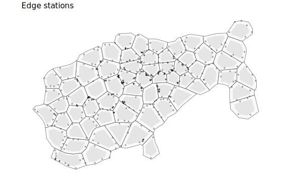
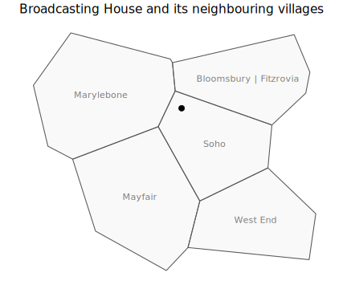
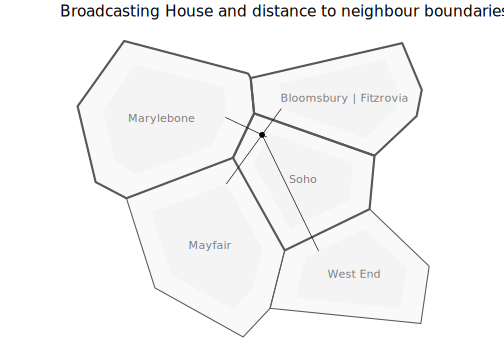
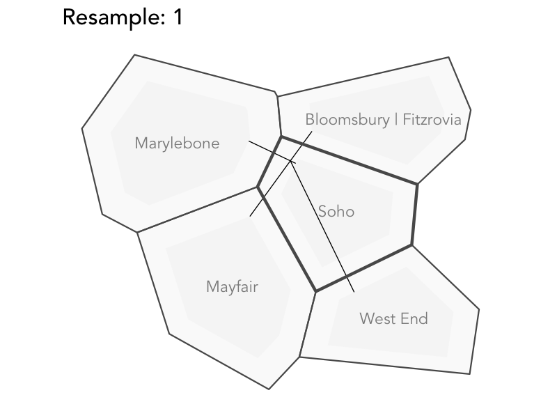

Explore MAUP zoning effects in bikeshare villages
================

## Introduction

This document explores uncertainty in bikeability scores due to MAUP
issues, specifically zoning effects when aggregating origin-destination
docking stations to villages.

Please cite:

Beecham, R., Yang, Y., Tait, C. and Lovelace, R. *Connected bikeability
in London: which localities are better connected by bike and does this
matter?*. DOI: [osf.io/gbfz8](https://osf.io/gbfz8).

## Setup

### Required libraries

Required packages can be installed individually with
`install.packages(<package_name>)`. Core packages are imported into the
session with `library(<package_name>)`. Occasional use of packages is
made with the `<package-name>::<function-name>()` syntax so as to avoid
polluting the workspace.

``` r
pkgs <- c("tidyverse","sf", "here", "gganimate")
# If not already installed.
# install.packages(pkgs)
# Core packages
library(tidyverse)              # Bundle of packages for data manipulation.
library(sf)                     # For working with geospatial data.
library(here)

# ggplot theme for paper
source(here("code","theme_paper.R"))
theme_set(theme_paper())
```

### Load data : OD index (by docking station pair) and villages

Load in the bikeshare villages dataset, docking-station-level OD
datasets (trips, bikeability), and docking stations data.

``` r
# Read in villages.
villages <- st_read(here("data", "grid_real_sf.geojson"))
# Read in OD bikeability scores.
bikeability <- read_csv(here("data", "connected_bikeability_index.csv"))

# Read in bikeshare trip data : docking-station>docking-station
bs_data <- fst::read_fst(here("data", "trips_df_all.fst")) |> 
  # All trips in 2018.
  filter(year(start_time)==2018)

# Load stations data.
stations <-  st_read(here("data", "stations.geojson")) 
```

## Identify edge stations and their neighbours

The zoning effects occur where docking stations at the edge of a
bikeshare village boundary might easily be assigned to that of a
neighbouring village.

So first we identify those docking stations that tend towards boundary
cases. This is achieved by rescaling the bikeshare village polygons, as
below.

``` r
# Create rescaled polygons to identify stations towards the edge of villages.
villages_real <- villages |> filter(type=="real") |> mutate(row_id=row_number())
villages_centroids <- st_centroid(villages_real)
villages_scaled <- (
  villages_real|> pull(geometry) - 
    villages_centroids |> filter(type=="real") |> pull(geometry)) * 0.7 + 
  villages_centroids |> filter(type=="real") |> pull(geometry) 
st_crs(villages_scaled) <- 27700
villages_scaled <- villages_scaled |> as_tibble() |> st_as_sf(crs=27700) |> 
  mutate(row_id=row_number(), name=villages_real |> pull(name))

# Identify those stations on edges
stations_outside <- stations |> anti_join(
  stations |> st_filter(villages_scaled) |> st_drop_geometry() |> select(operator_name)
  )
# Plot to visually inspect that are indeed towards edge of village.
plot <- ggplot() +
  geom_sf(data=villages_real, alpha=.2, size=.3) +
  geom_sf(data=villages_scaled, size=0) +
  geom_sf(data=stations_outside, alpha=.3, size=.9) +
  labs(title="Edge stations")+
  theme(axis.text=element_blank())
  
ggsave(filename=here("figs", "edge-stations.png"), plot=plot,width=8, height=5, dpi=300)
ggsave(filename=here("figs","edge-stations.svg"), plot=plot,width=8, height=5)  
```



For each of these edge stations we then need to identify neighbouring
villages that may be candidates to which they could have been
reassigned. When doing so we want to consider the distance from each
edge station to the nearest *boundary* of neighbouring villages, not the
centroid.

To narrow the search-space, for each edge docking station, find the
neighbours of the village it is contained by using adjacency relations.

Below we test this with a single station: *Broadcasting House*, within
Soho village.

``` r
bh <- stations_outside |> filter(operator_name == "Broadcasting House, Marylebone") |> 
  st_join(villages_real |> select(name)) 
# Find IDs for its neighbouring villages.
bh_nbs <- villages_real |> filter(name== bh |> pull(name)) |> 
   st_intersects(villages_real) |> unlist()
# Filter these villages for examination.
temp_bh_nbs <- villages_real |> 
            mutate(row_id=row_number()) |> filter(row_id %in% bh_nbs)
# Plot to verify
plot <- ggplot() +
  geom_sf(data=temp_bh_nbs  , alpha=.2) +
  geom_text(data=temp_bh_nbs, aes(x=east, y=north,label=name), alpha=.5, family="Avenir Book") +
  geom_sf(data=bh, size=3) +
  labs(title="Broadcasting House and its neighbouring villages") +
  theme(axis.text=element_blank(), axis.title.x=element_blank(), axis.title.y=element_blank())
ggsave(filename=here("figs", "bh-villages.png"), plot=plot,width=6, height=5, dpi=300)
ggsave(filename=here("figs","bh-villages.svg"), plot=plot,width=6, height=5) 
```

<figure>

<figcaption aria-hidden="true">Broadcasting House</figcaption>
</figure>

Next we want to calculate the distance between this docking station and
the closest part of the boundary of its neighbours. This is to make sure
that this distance crosses over into neighbouing villages. Therefore we
caluclate this based on the villages_scaled data. We also decide on a
reasonable distance threshold, 500 metres, beyond which it would not
make sense to reallocate due to boundary effects.

``` r
# Make some tighter boundaries.
villages_scaled <- (
  villages_real|> pull(geometry) - 
    villages_centroids |> filter(type=="real") |> pull(geometry)) * 0.7 + 
  villages_centroids |> filter(type=="real") |> pull(geometry) 
st_crs(villages_scaled) <- 27700
villages_scaled <- villages_scaled |> as_tibble() |> st_as_sf(crs=27700) |> 
  mutate(row_id=row_number(), name=villages_real |> pull(name))

temp_bh_nbs_scaled <- villages_scaled |> mutate(row_id=row_number()) |> filter(row_id %in% bh_nbs)
# Calculate those distances to neighbours.
nearest <- st_nearest_points(bh, temp_bh_nbs_scaled) 
bw<-500
dists <- nearest |>
    st_as_sf() |>
    st_coordinates() |>
    as_tibble() |>
    mutate(is_dest=row_number() %% 2 == 0) |>
    filter(is_dest) |>
    st_as_sf(coords=c("X","Y"), crs=27700) |> select(geometry) |>
    st_join(temp_bh_nbs |> select(nearest_name=name)) |>
    mutate(dist=as.numeric(st_length(nearest))) |> 
    filter(dist<bw)
# Plot those villages that are candidates for being reallocated.
plot <- ggplot() +
  geom_sf(data=temp_bh_nbs  , alpha=.2) +
  geom_sf(data=temp_bh_nbs_scaled  , alpha=.2, size=0) +
  geom_text(data=temp_bh_nbs, aes(x=east, y=north,label=name), alpha=.5, family="Avenir Book") +
  geom_sf(data=temp_bh_nbs |> filter(name %in% dists$nearest_name) , fill="transparent", size=1) +
  geom_sf(data=nearest, size=.3) +
  geom_sf(data=bh, size=2) +
  labs(title="Broadcasting House and distance to neighbour boundaries") +
  theme(axis.text=element_blank(), axis.title.x=element_blank(), axis.title.y=element_blank())
ggsave(filename=here("figs", "bh-neighbours.png"), plot=plot,width=7, height=5, dpi=300)
ggsave(filename=here("figs","bh-neighbours.svg"), plot=plot,width=7, height=5) 
```

<figure>

<figcaption aria-hidden="true">Broadcasting House and
neighbours</figcaption>
</figure>

## Reallocate stochastically

We then want to have some stochastic process whereby points are
reallocated to villages including that within which they are contained
with a probability that varies by these distances.

``` r
# Here we use 1/d, but it may be instructive to vary this with an exponent to 
# increase / decrease the penalty.
# E.g. d^2 to increase, d^.5 to decrease.
dat <- dists |> mutate(w=(1/(dist)), prop=round((w/sum(w)*100))) |>  select(nearest_name, prop) |> st_drop_geometry()
# Generate resamples.
resamples<-sample(dat$nearest_name, size=100, prob=dat$prop, replace=TRUE) 
bh_animate <- bh |> mutate(villages=list(resamples)) |> unnest(villages) |> st_drop_geometry() |> 
  left_join(
    villages_real |> select(name), by=c("villages"="name")) |> 
  mutate(boot_id=row_number()) |> st_as_sf()

# Plot resamples.
anim <- bh_animate |> 
  ggplot() +
  geom_sf(data=temp_bh_nbs  , alpha=.2) +
  geom_sf(data=temp_bh_nbs_scaled  , alpha=.2, size=0) +
  geom_text(data=temp_bh_nbs, aes(x=east, y=north,label=name), alpha=.5, family="Avenir Book") +
  geom_sf(data=nearest, size=.3) +
  geom_sf(fill="transparent", size=1) +
  labs(title = "Resample: {closest_state}") +
  gganimate::transition_states(boot_id) +
  theme(axis.text=element_blank(), axis.title.x=element_blank(), axis.title.y=element_blank())

gganimate::animate(nframes=210, fps=20, anim, start_pause=0, end_pause=10, width=800, height=600, res=150, renderer=gganimate::gifski_renderer(here("figs", "anim_bh.gif")))
```

<figure>

<figcaption aria-hidden="true">Stochastic reassignment of BH to
neighbours</figcaption>
</figure>

## Apply to full dataset

So first we build up a dataset where for each edge station
(`outside_station`) geometries for their village neighbours are stored,
both the original and rescaled geometries.

``` r
temp_outside_stations <- stations_outside |> st_join(villages_real |> select(name)) 
village_neighbours <- 
  villages_real |> filter(name %in% temp_outside_stations$name |> unique()) |>
  select(name) |>  mutate(nbs=st_intersects(geometry, villages_real) |>  unname()) |> st_drop_geometry() |> 
  nest(data=nbs) |> 
  mutate(
    ids=map(data,~.x |> unname() |> unlist()),
    geom_orig=map(ids, ~ villages_real |> filter(row_id %in% .x) |> select(nearest_name=name, geometry)), 
    geom_scaled=map(ids, ~ villages_scaled |> filter(row_id %in% .x) |> select(nearest_name=name, geometry))
  ) |> select(-data)
```

The next task is to build a dataset containing the distances between
each edge station and its nearest village boundaries. The same approach
is used as with the *Broadcasting House* example, but we use a
functional (`map()`) to scale this up to every edge docking station.

``` r
get_neighbour <- function(pts, nbs_scaled, nbs) {
  nearest <- st_nearest_points(pts, nbs_scaled) 
  dists <- nearest |>
    st_as_sf() |>
    st_coordinates() |>
    as_tibble() |>
    mutate(is_dest=row_number() %% 2 == 0) |>
    filter(is_dest) |>
    st_as_sf(coords=c("X","Y"), crs=27700) |> select(geometry) |>
    st_join(nbs |> select(name=nearest_name)) |>
    mutate(dist=as.numeric(st_length(nearest))) 
  return(dists)
}

temp_outside_station_neighbours <- temp_outside_stations |> 
  nest(data=-operator_name) |> 
  mutate(
    dists=map(
      data,
      ~get_neighbour(
        pts=.x$geometry,
        nbs_scaled=village_neighbours |> filter(name==.x$name) |> select(name, geom_scaled) |> 
               unnest(cols=geom_scaled) |> st_as_sf(),
        nbs=village_neighbours |> filter(name==.x$name) |> select(name, geom_orig) |> 
        unnest(cols=geom_orig) |> st_as_sf()
      )
    )
  )
```

Again there is a stochastic, Monte Carlo-type, approach to resampling
villages of edge stations in a probabilistic way. We create 100
simulated village positions for each edge docking station.

``` r
temp_resampled_dat <- temp_outside_station_neighbours |> 
  mutate(
    dat=map(dists, 
            ~.x |> filter(dist<500) |> mutate(w=(1/dist), prop=round((w/sum(w)*100))) |>
              select(name, prop) |> st_drop_geometry()),
    resamples=
      map(dat,
          ~tibble(
            relocate=sample(.x$name, size=100, prob=.x$prop, replace=TRUE)
            )
      ),
    village=map(data, ~first(.x$name))
  ) |> 
  select(operator_name, village, resamples) |> unnest(c(resamples)) |> unnest(c(village)) |> 
  group_by(operator_name) |> mutate(boot_id=row_number()) |> ungroup()
  
stations_inside <- stations |>  
  st_join(villages_real |> select(name)) |> st_drop_geometry() |>  
  filter(!operator_name %in% (temp_resampled_dat$operator_name |> unique())) |> select(-id, village=name) |> unique() |> 
  nest(data=village) |> 
  mutate(
    relocate=map(data, ~rep(.x$village,times=100))
  ) |> 
  select(-data) |> unnest(relocate) |> 
  group_by(operator_name) |> 
  mutate(village=relocate, boot_id=row_number()) |> 
  ungroup()

resampled_dat <- bind_rows(temp_resampled_dat, stations_inside) |> 
  inner_join(stations |> st_drop_geometry() |> group_by(operator_name) |> summarise(id=first(id)) |> ungroup())
```

For each docking-station OD pair, we generate 100 simulated datasets
with the edge docking stations reassigned to neighbouring villages
probabilistically.

``` r
get_resampled_dat <- function(boot_id, trip_dat, resampled) {
  dat <- trip_dat |> 
    inner_join(resampled |> filter(boot_id==!!boot_id) |> select(id, o_village=relocate), by=c("start_station_id"="id")) |> 
  left_join(resampled |> filter(boot_id==!!boot_id) |> select(id, d_village=relocate), by=c("end_station_id"="id")) |> 
    group_by(o_village, d_village) |> 
    summarise(count=sum(count)) |> ungroup() |> mutate(boot_id=!!boot_id)
  return(dat)
}

simulated_data <- bind_rows(
  map(1:100, 
      ~get_resampled_dat(boot_id=quo(.x), trip_dat=bs_data_ods, resampled=resampled_dat |> select(relocate,id, boot_id))
  )
)
```

Animate over the simulated data to generate a hypothetical outcome plot
[https://journals.plos.org/plosone/article?id=10.1371/journal.pone.0142444](Hullman%20et%20al.%202015)
of candidate maps, in so doing we experience uncertainty due to zoning
effects.

``` r
anim_count_map <- iterations |> 
  mutate(label=d_village) |> 
  filter(d_village=="Westminster") |> 
  left_join(villages_real, by=c("o_village"="name")) |> st_as_sf() |> 
  ggplot()+
  geom_sf(data= . %>% group_by(boot_id) %>% summarise(), colour="#616161", fill="transparent", size=0.65)+
  geom_sf(aes(fill=count^.7), colour="#616161", size=0.3)+
  geom_sf(data=. %>%  filter(o_village==d_village), 
            colour="#616161", fill="transparent", size=0.65) +
  geom_text(data= . %>%  filter(o_village==d_village), 
            aes(x=east, y=north, label=str_sub(d_village,1,1)), 
            colour="#252525", alpha=0.9, size=4, show.legend=FALSE, 
            hjust="centre", vjust="middle", family="Avenir Book")+
  coord_sf(crs=st_crs(villages_real), datum=NA)+
  guides(fill=FALSE)+
  scale_fill_distiller(
    palette="Blues", direction=1, 
    guide = "colourbar", na.value="#f7f7f7"
  )+
  gganimate::transition_states(boot_id) +
  labs(title = "Resample: {closest_state}") +
  theme_paper() +
  theme(
    axis.title.x=element_blank(),axis.title.y=element_blank(),
    panel.background = element_rect(fill="#ffffff", colour="#ffffff"),
  ) 

gganimate::animate(nframes=210, fps=20, anim_count_map, start_pause=0,end_pause=10, width=1100, height=700, res=150, renderer=gganimate::gifski_renderer(here("figs", "anim_zoning.gif")))
```


