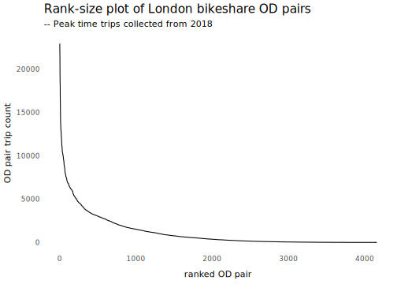
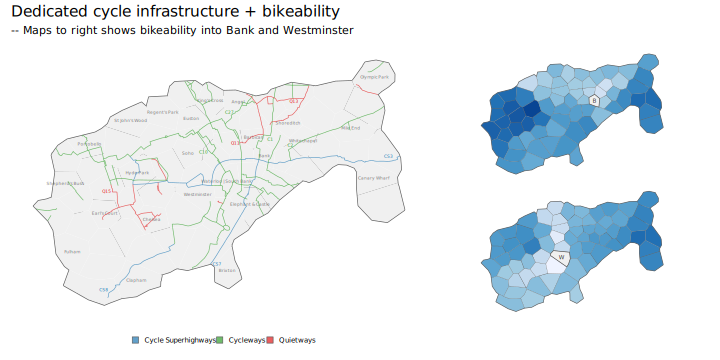

## Introduction

This document explores how OD-level bikeability scores vary with observed trips made in the bikeshare scheme and also travel-to-work trips made within the scheme bounds according to 2011 Census. 

Such an approach has been used previously to *validate* bikeability scores under the assumption that trips are more likely to be made in parts of a city that are more amenable to cycling. Such an assumption is unlikely to hold for our connected bikeability scores aggregated to bikeshare village level.  Areas of London that need to be accessed for work and other activities may not support dedicated cycling infrastructure. Trip frequencies are also a function of distinctive usage patterns that are difficult to control for -- at peak times, connecting key rail stations with workplace centres to solve the `last mile' problem. Finally, our bikeability scores are based on all OD village pair combinations, but some of those OD village pairs will be unlikely to be made, for various substantive reasons.

To partially adjust for these, we set up a regression model exploring how OD bikeability (outcome) varies by `commuter' bikeshare trip counts (those occurring at peak times), with further terms added to adjust for the fact that commuter demand will vary depending on where jobs and workers are located within the scheme's bounds (travel-to-work data from 2011 Census is added as an explanatory variable); and a random intecept term added on whether the village covers key `hub' docking stations located at rail terminals and which are manually replenished with bikes at key times. Finally, only  OD pairs into villages that are frequently cycled (top 250 OD village pairs) are used.


Please cite:

Beecham, R., Yang, Y., Tait, C. and Lovelace, R. _Connected bikeability in London: which localities are better connected by bike and does this matter?_. DOI: [osf.io/gbfz8](https://osf.io/gbfz8).

## Setup

### Required libraries

Required packages can be installed individually with `install.packages(<package_name>)`. Core packages are imported into the session with `library(<package_name>)`. Occasional use of packages is made with the `<package-name>::<function-name>()` syntax to avoid polluting the workspace.

```{r, eval=FALSE}
pkgs <- c("tidyverse","sf", "here", "gganimate")
# If not already installed.
# install.packages(pkgs)
# Core packages
library(tidyverse)              # Bundle of packages for data manipulation.
library(sf)                     # For working with geospatial data.
library(here)
library(lubridate)

# ggplot theme for paper
source(here("code","theme_paper.R"))
```

## Load data 

Load in LCHS trips data (docking station OD pairs) commute trips (between MSOAs) and the village geographies.

```{r, eval=FALSE}
# Read in villages.
villages <- st_read(here("data", "grid_real_sf.geojson"))
villages_real <- villages |> filter(type=="real") |> mutate(row_id=row_number())
# Read in OD bikeability scores.
bikeability <- read_csv(here("data", "connected_bikeability_index.csv"))

# Read in OD commute data : msoa-msoa
commute_data  <- read_csv(here("data", "wicid_output_occupation.csv")) |>
  select(origin_msoa, destination_msoa, all)
# MSOA boundary data (from https://geoportal.statistics.gov.uk/s)
# Simplified using rmapshaper
msoa_boundaries <- st_read(here("data", "msoa_boundaries.geojson"))
# Filter on all MSOAs within London.
region_boundaries <- st_read(here("data", "regions.geojson")) %>%
  filter(RGN20NM=="London")
temp <- msoa_boundaries %>% st_filter(region_boundaries %>% select(RGN20NM))
# Not very simplified as City of London in so small.
temp <- temp %>% rmapshaper::ms_simplify(keep=.1)
# Cast to OSGB.
temp <- temp %>% st_transform(crs=27700)

# Read in bikeshare trip data : docking-station>docking-station
bs_data <- fst::read_fst(here("data", "trips_df_all.fst")) |> 
  # All trips in 2018.
  filter(year(start_time)==2018)
```

## Assign 2011 Census commutes to villages 

The two geographies, MSOAs and villages, intersect in many different ways and cannot be easily reconciled. Our solution is to generate individual records for each commute -- to detach commutes from their aggregated MSOA-MSOA geography. For each observation (commuter record) we generate estimated point locations by random spatial sampling within the polygon area of that commute’s origin and destination MSOA. These estimated point locations are then used to assign commute origin and destination locations to the bikeshare villages in which they are contained.

We define a function for the random spatial sampling, using [`st_sample`](https://r-spatial.github.io/sf/reference/st_sample.html).

```{r, eval=FALSE}
#' Random spatial sample within polygon.
#'
#'
#' @param geo An sf MULTIPOLYGON object.
#' @param n Desired sample size.
#'
#' @return A tidy data frame (tibble) with ST_POINT geometry defining point locations.
#'
#' @export
geo_sample <- function(geo, n) {
  return(
    sf::st_sample(x=geo, size=n) %>%
    st_coordinates()
  )
}
```

We then generate a large set ($n=2000$) of sampled points for each MSOA, held in `sampled_msoas`.

```{r, eval=FALSE}
# Buffer around bikeshare scheme villages.
temp_buffer <- villages %>% filter(type=="real") %>%
  st_buffer(dist=0, .predictate=st_intersects) %>%
  summarise()
temp_filtered <- temp  %>% st_filter(temp_buffer, .predictate=st_intersects())

# For quick searching, generate sampled point locations for each MSOA.
# Resample from these locations to then generate origin and destination points
# for each commute.
sampled_msoas <- temp_filtered %>% select(msoa=MSOA11CD) %>%
  nest(data=-c(msoa)) %>%
  mutate(
    sampled_points=map(data,~geo_sample(geo=.x,n=2000) %>%
                     as_tibble(.name_repair=~c("east", "north"))
    )
  ) %>%
  unnest(-data) %>%
  select(-data)

# Filter all Census msoas with origins *and* destinations within the buffer.
commute_data_filtered <- commute_data %>%
    rowwise() %>%
    mutate(all=sum(all)) %>%
    ungroup() %>%
    select(origin_msoa, destination_msoa, all) %>%
    filter(
      origin_msoa %in% (temp_filtered %>% pull(MSOA11CD)) &
        destination_msoa %in% (temp_filtered %>% pull(MSOA11CD))
      )
```

For each commute we then search in `sampled_msoas` to attach point locations, and do this separately for professional and non-professional commutes. This is achieved by taking each MSOA-MSOA OD pair and sampling MSOA point locations by origin and destination according to the commute count of that OD pair.


```{r, eval=FALSE}
# Generate points for non-profs.
commute_points <- commute_data_filtered %>% mutate(od_pair=paste0(origin_msoa,"-",destination_msoa)) %>%
  filter(all>0) %>%
  nest(data=-c(od_pair)) %>%
  mutate(
    o_count=map(
      data,
      ~sample_n(
        sampled_msoas %>% filter(msoa==.x %>% pull(origin_msoa)),
        size=.x %>% pull(all)
        ) %>%
      as_tibble(.name_repair=~c("o_msoa","o_east", "o_north"))
    ),
   d_count=map(
     data,
     ~sample_n(
       sampled_msoas %>% filter(msoa==.x %>% pull(destination_msoa)),
       size=.x %>% pull(all)
       ) %>%
      as_tibble(.name_repair=~c("d_msoa","d_east", "d_north"))
   ),
  ) %>%
  unnest(-data) %>%
  select(-data)
```

Finally, commutes are assigned to the bikeshare village in which they are contained using [`st_join`](https://r-spatial.github.io/sf/reference/st_join.html), and we then summarise over village-village OD pairs.

```{r, eval=FALSE}
commute_villages  <- commute_points %>% select(-c(od_pair,o_msoa, d_msoa)) %>%
  st_as_sf(coords=c("o_east", "o_north"), crs=27700) %>%
  st_join(villages %>% filter(type=="real") %>%  select(o_village=name), .predicate=st_intersects()) %>%
  st_drop_geometry() %>%
  st_as_sf(coords=c("d_east", "d_north"), crs=27700) %>%
  st_join(villages %>% filter(type=="real") %>%  select(d_village=name), .predicate=st_intersects())  %>%
  st_drop_geometry() %>%
  filter(!is.na(o_village) & !is.na(d_village)) %>%
  group_by(o_village, d_village) %>%
  summarise(count=n())
```

## Assign bikeshare trips to villages 

Bikeshare trips can be straightforwardly assigned to villages. Given that trajectories are not known, and so estimated using a routing algorithm, we have more confidence in the routes being reliable approximations of actually cycled trajectories for utility, commuter journeys, and so we filter on those trips pairs more likely to be commutes -- those occurring during the weekday peak. 

```{r, eval=FALSE}
# Load stations data.
stations <-  st_read(here("data", "stations.geojson")) 
# Join on villages.
stations <- stations |> st_join(villages %>% filter(type=="real") %>%  select(village=name), .predicate=st_intersects())

# Identify trip types.
# Trip type time bins.
am_peak_int <- interval(hms::as_hms("06:00:00"), hms::as_hms("09:59:59"))
pm_peak_int <- interval(hms::as_hms("16:00:00"), hms::as_hms("20:59:59"))
interpeak_int <- interval(hms::as_hms("10:00:00"), hms::as_hms("15:59:59"))
night_int <- interval(hms::as_hms("21:00:00"), as.POSIXct(hms::as_hms("05:59:59"))+days(1))

bs_data <- bs_data |> 
  mutate(
    t=as.POSIXct(hms::as_hms(start_time)),
    wkday=!wday(start_time, label=TRUE) %in% c("Sat", "Sun"),
    commute= wkday & (t %within% am_peak_int ) | (t %within% pm_peak_int )
  ) |> 
  select(-c(t,wkday))

# Join on trips and summarise over village>village counts.
bs_trips_villages  <- bs_data |>  
  left_join(stations |> select(id, o_village=village) |> st_drop_geometry(), by=c("start_station_id"="id")) |> 
  left_join(stations |> select(id, d_village=village) |> st_drop_geometry(), by=c("end_station_id"="id")) |> 
  group_by(o_village, d_village) %>%
  summarise(count=n()+1, commute=sum(as.numeric(commute))+1, leisure=(count-commute)+1)
```

## Model bikeability against counts

In order to set-up the model, we create the dataset by joining the bikeability data on the bikeshare trip and commute data aggregated to bikeshare village level. We also identify bikeshare villages that contain hub docking stations and so code up OD pairs for those hub stations -- at Warerloo, King's Cross and Holborn. Inspecting a frequency distribution of OD trips reinforces the fact that a large number of village OD pairs are cycled infrequently.

```{r, eval=FALSE}
# Join OD village bikeability data on the commute and bikeshare trip count datasets. 
model_data <- bikeability |> 
  left_join(commute_villages |> ungroup() |> rename(commute_count=count), by=c("start_bv_name"="o_village", "end_bv_name"="d_village")) |> 
    left_join(bs_trips_villages |> ungroup() |>  rename(bs_count=count, bs_commute=commute, bs_leisure=leisure), by=c("start_bv_name"="o_village", "end_bv_name"="d_village")) 
# Identify OD village pairs involving hub stations.
model_data <- model_data |> 
  mutate(is_hub=case_when(
           end_bv_name %in% (c("Waterloo | South Bank", "King's Cross")) ~ TRUE,
           start_bv_name %in% (c("Waterloo | South Bank", "King's Cross")) ~ TRUE,
           TRUE ~ FALSE
           )
         )


plot <- model_data |> mutate(bs_rank=min_rank(-bs_commute)) |> 
  filter(bs_rank<1000) |> 
  ggplot(aes(x=bs_rank, y=bs_commute)) + 
  geom_line() +
  labs(x="ranked OD pair", y="OD pair trip count", title="Rank-size plot of London bikeshare OD pairs", subtitle="-- Trip data collected from 2018")
ggsave(filename=here("figs", "rank-size.png"), plot=plot,width=7, height=5, dpi=300)
ggsave(filename=here("figs","rank-size.svg"), plot=plot,width=7, height=5)   
```

{width=60%}


```{r, eval=FALSE}  
library(tidymodels)
install.packages("multilevelmod")
library(multilevelmod)
install.packages("broom.mixed")
library(broom.mixed)

lmer_spec <- 
  linear_reg() |>  
  set_engine("lmer")

model_data |> 
  mutate(bs_rank=min_rank(-bs_commute)) |> 
  filter(bs_rank<500) |>
  mutate(
    across(
      .cols=c(bs_count,bs_commute, bs_leisure, commute_count), 
      .fns=~replace_na(.x,1) 
    ),
     across(
      .cols=c(bs_count,bs_commute, bs_leisure, commute_count), 
      .fns=~log(.x)
    ),
    across(
      .cols=c(bs_count,bs_commute, bs_leisure, commute_count), 
      .fns=~(.x-mean(.x))/sd(.x),
      .names = "z_{.col}"
    ),
  )  |> 
  mutate(type="full_dataset") |> 
  nest(data=-type) |> 
  mutate(
    model=map(data, ~
                lmer_spec |>
                parsnip::fit(bv_od_cb_index ~  z_bs_commute + z_commute_count + (1 | is_hub), data=.x)),
    # model=map(data, ~lm(bv_od_cb_index ~  z_bs_commute + z_commute_count, data=.x)),
    values=map2(model, data, ~augment(.x, new_data=.y)),
    fits=map(model, glance),
    coefs=map(model, tidy)
  ) 
```


## Compare against infrastructure provision 

```{r, eval=FALSE, echo=FALSE}  
# TfL release of key cycle routes data 
url <- "https://cycling.data.tfl.gov.uk/CycleRoutes/CycleRoutes.json"
infra <-  st_read(url) |> st_transform(crs=27700)

d_maps <- model_data |>
  filter(end_bv_name %in% c("Westminster", "Bank")) |> 
  left_join(villages_real, by=c("start_bv_name"="name")) |> st_as_sf() |> 
  ggplot()+
  geom_sf(data= . %>% group_by(end_bv_name) %>%  summarise(), colour="#616161", fill="transparent", size=0.5)+
  geom_sf(aes(fill=bv_od_cb_index), colour="#616161", size=0.1)+
   geom_sf(data=villages_real |>  filter(name %in% c("Westminster", "Bank")) |> mutate(end_bv_name=name)
           , fill="#f0f0f0", size=0.3)+
  geom_text(data= villages_real %>%  filter(name %in% c("Westminster", "Bank")) |> mutate(end_bv_name=name), 
             aes(x=east, y=north, label=str_sub(name,1,1)), 
             colour="#252525", alpha=0.9, size=2, show.legend=FALSE, 
             hjust="centre", vjust="middle", family="Avenir Book")+
  coord_sf(crs=st_crs(villages_real), datum=NA)+
  guides(fill="none")+
  scale_fill_distiller(
    palette="Blues", direction=1, 
    guide = "colourbar", na.value="#f7f7f7"
  )+
  facet_wrap(~end_bv_name, nrow=2) +
  theme_paper() +
  theme(
    axis.title.x=element_blank(),axis.title.y=element_blank(),
    panel.background = element_rect(fill="#ffffff", colour="#ffffff")
    ,strip.text.x = element_blank()
  ) 


infra_scheme <- infra |>
  filter(Status=="Open") |> st_intersection(villages_real, st_crs(villages_real))

cs3 <- infra_scheme |> filter(Label=="CS3") |> summarise() |> st_coordinates() |> as_tibble() |> mutate(east=X, north=Y, start_east=max(east), label="CS3", Programme="Cycle Superhighways") |> filter(east==start_east)
cs7 <- infra_scheme |> filter(Label=="CS7") |> summarise() |>  st_coordinates() |> as_tibble() |> summarise(east=X, north=Y, start_north=min(north), label="CS7", Programme="Cycle Superhighways") |> filter(north==start_north)
cs8 <- infra_scheme |> filter(Label=="CS8") |> sample_n(1) |> st_coordinates() |> as_tibble() |> summarise(east=mean(X), north=mean(Y), label="CS8", Programme="Cycle Superhighways")
c1 <- infra_scheme |> filter(Label=="C1") |> sample_n(1) |> st_coordinates() |> as_tibble() |> summarise(east=mean(X), north=mean(Y), label="C1", Programme="Cycleways")
c10 <- infra_scheme |> filter(Label=="C10") |> sample_n(1) |> st_coordinates() |> as_tibble() |> summarise(east=mean(X), north=mean(Y), label="C10", Programme="Cycleways")
c2 <- infra_scheme |> filter(Label=="C2") |> sample_n(1) |> st_coordinates() |> as_tibble() |> summarise(east=mean(X), north=mean(Y), label="C2", Programme="Cycleways")
c27 <- infra_scheme |> filter(Label=="C27") |> sample_n(1) |> st_coordinates() |> as_tibble() |> summarise(east=mean(X), north=mean(Y), label="C27", Programme="Cycleways")
q11 <- infra_scheme |> filter(Label=="Q11") |> sample_n(1) |> st_coordinates() |> as_tibble() |> summarise(east=mean(X), north=mean(Y), label="Q11", Programme="Quietways")
q13 <- infra_scheme |> filter(Label=="Q13") |> sample_n(1) |> st_coordinates() |> as_tibble() |> summarise(east=mean(X), north=mean(Y), label="Q13", Programme="Quietways")
q15 <- infra_scheme |> filter(Label=="Q15") |> sample_n(1) |> st_coordinates() |> as_tibble() |> summarise(east=mean(X), north=mean(Y), label="Q15", Programme="Quietways")

label_villages <- c("Bank", "Angel", "Euston", "Westminster", "Canary Wharf", "Brixton", "Chelsea", "Earl's Court", "Hyde Park", "King's Cross", "Regent's Park", "Olympic Park", "Mile End", "Whitechapel", "Shoreditch","St John's Wood", "Fulham", "Soho", "Elephant & Castle | Walworth", "Waterloo | South Bank", "Clapham", "Shepherd's Bush", "Portobello", "Barbican")

inf_map <- ggplot()+
  geom_sf(data= villages_real %>% summarise(), colour="#616161", fill="transparent", size=0.65)+
  geom_sf(data= villages_real, fill="#f0f0f0", size=0)+
  geom_text(data= villages_real |> filter(name %in% label_villages) |> 
              mutate(name=if_else(name=="Elephant & Castle | Walworth", "Elephant & Castle", name)), aes(x=east, y=north, label=name), size=1.5, family="Avenir Book", alpha=.5)+
  geom_sf(data=infra_scheme,
          aes(colour=Programme, fill=Programme), alpha=.7, size=.3
          ) +
  geom_text(data=cs3, aes(x=east-500, y=north, label=label, colour=Programme), family="Avenir Medium", size=1.5) +
  geom_text(data=cs7, aes(x=east+300, y=north, label=label, colour=Programme), family="Avenir Medium", size=1.5) +
  geom_text(data=cs8, aes(x=east-400, y=north, label=label, colour=Programme), family="Avenir Medium", size=1.5) +
  geom_text(data=c1, aes(x=east+400, y=north, label=label, colour=Programme), family="Avenir Medium", size=1.5) +
  geom_text(data=c10, aes(x=east-500, y=north, label=label, colour=Programme), family="Avenir Medium", size=1.5) +
   geom_text(data=c2, aes(x=east-500, y=north-150, label=label, colour=Programme), family="Avenir Medium", size=1.5) +
  geom_text(data=c27, aes(x=east-700, y=north-350, label=label, colour=Programme), family="Avenir Medium", size=1.5) +
  geom_text(data=q11, aes(x=east-700, y=north-200, label=label, colour=Programme), family="Avenir Medium", size=1.5)+
  geom_text(data=q13, aes(x=east-350, y=north, label=label, colour=Programme), family="Avenir Medium", size=1.5)+
  geom_text(data=q15, aes(x=east-350, y=north, label=label, colour=Programme), family="Avenir Medium", size=1.5)+
  scale_colour_manual(values=c("#1f78b4", "#33a02c", "#e31a1c")) +
  #scale_fill_manual(values=c("#a6cee3", "#b2df8a", "#fb9a99")) +
  scale_fill_manual(values=c("#1f78b4", "#33a02c", "#e31a1c")) +
  guides(colour="none")+
  theme(
    axis.text=element_blank(), axis.title.x=element_blank(), axis.title.y=element_blank(),
    legend.key.size = unit(.25, 'cm'),
    legend.title = element_blank(),
    legend.text = element_text(size=7)
  ) 


library(patchwork)
plot <- inf_map + d_maps +
  plot_layout(widths = c(3, 2)) +
  plot_annotation(title="Dedicated cycle infrastructure + bikeability", subtitle="-- Maps to right shows bikeability into Bank and Westminster") 
  

ggsave(filename=here("figs", "infra.png"), plot=plot,width=10, height=5, dpi=300)
ggsave(filename=here("figs","infra.svg"), plot=plot,width=10, height=5)   
```

