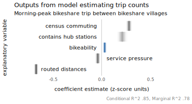

## Introduction

This document explores how OD-level bikeability scores vary with observed trips made in the bikeshare scheme. Such an approach has been used previously to *validate* bikeability scores under the assumption that trips are more likely to be made in parts of a city that are amenable to cycling.

This assumption is difficult to analyse empirically without conditioning on some fairly substantial confounding context. First, the amount of cycling between OD locations in the LCHS is heavily conflated with demand -- where work and other activities are concentrated in London. Second, heavy competition for bikes and docking stations leads to service pressure, making certain parts of the scheme more viable than others. Third, related to demand, LCHS trip patterns are dominated by two distinct functions that are difficult to adjust for: a leisure-type function characterised by trips coinciding with London’s parks and tourist attractions and a commuter-type function where so-called ‘last-mile’ trips connect major rail terminals and workplace centres. Fourth, bikeshare schemes incentivise short trips, both in their physical design and pricing regimes; journeys connecting more remote OD village pairs therefore become quite impractical. For our model to make sense, it is necessary to account for at least some of this confounding context.

We set up a regression model exploring how morning trip counts in the LCHS (outcome) varies with bikeability, net of *demand* (derived from Census 2011 travel-to-work data), *service pressure* (estimated from bikeshare station occupancy data), whether an OD pair involves a key *hub* docking station and also a random intercept term on *destination* village to reflect the fact that the pattern of trip frequencies will also vary systematically on the destination village ('workplace').

Later in the document we use OD maps ([Wood et al. 2010](https://www.tandfonline.com/doi/abs/10.1179/000870410X12658023467367)) to validate and explore patterns of bikeability visually and in the context of London's dedicated cycling infrastructure.

Please cite:

Beecham, R., Yang, Y., Tait, C. and Lovelace, R. (2023) "Connected bikeability in London: which localities are better connected by bike and does this matter?", *Environment & Planning B: Urban Analytics and City Science*. DOI: [osf.io/gbfz8](https://osf.io/gbfz8).

## Setup

### Required libraries

Required packages can be installed individually with `install.packages(<package_name>)`. Core packages are imported into the session with `library(<package_name>)`. Occasional use of packages is made with the `<package-name>::<function-name>()` syntax to avoid polluting the workspace.

```{r, eval=FALSE}
pkgs <- c("tidyverse", "lubridate", "here", "sf", "tidymodels", "ggdist", "distributional", "geosphere", "patchwork")
# If not already installed.
# install.packages(pkgs)

# Core packages.
library(here)
library(patchwork)
library(tidyverse)
library(lubridate)

# Geospatial packages.
library(sf)
library(geosphere)

# Modelling packages.
library(tidymodels)
# install.packages("multilevelmod")
library(multilevelmod)
# install.packages("broom.mixed")
library(broom.mixed)
# install.packages("performance")
library(distributional)
library(ggdist)

# ggplot theme for paper, plus plot helpers.
source(here("code","theme_paper.R"))
source(here("code","plot_helpers.R"))
```

## Load data

Load in LCHS trips data (docking station OD pairs), commute data (between MSOAs), the village geographies and the village-village bikeability scores (with zoning adjustment). For brevity, the code block loading this data has been hidden here, but can be viewed in the raw [validate-scores.Rmd](validate-scores.Rmd) file.

```{r, eval=FALSE, echo=FALSE}
# Read in villages.
villages <- st_read(here("data", "grid_real_sf.geojson"))
villages_real <- villages |> filter(type=="real") |> mutate(row_id=row_number())

# Read in OD commute data : msoa-msoa.
commute_data  <- read_csv(here("data", "wicid_output_occupation.csv")) |>
  select(origin_msoa, destination_msoa, all)
# MSOA boundary data (from https://geoportal.statistics.gov.uk/), simplified using rmapshaper.
msoa_boundaries <- st_read(here("data", "msoa_boundaries.geojson"))
# Filter on all MSOAs within London.
region_boundaries <- st_read(here("data", "regions.geojson")) |>
  filter(RGN20NM=="London")
temp <- msoa_boundaries |> st_filter(region_boundaries |> select(RGN20NM))
# Not very simplified as City of London so small.
temp <- temp |> rmapshaper::ms_simplify(keep=.1)
# Cast to OSGB.
temp <- temp |> st_transform(crs=27700)

# Read in bikeshare trip data : docking-station>docking-station.
bs_data <- fst::read_fst(here("data", "trips_2018.fst"))
# Load stations data.
bike_stations <-  st_read(here("data", "bike_stations.geojson")) |> st_transform(crs=27700)
# Join on villages.
bike_stations  <- bike_stations |> st_join(villages |> filter(type=="real") |>  select(village=name), .predicate=st_intersects())
# Stations coords
bike_stations_coords <- bike_stations |> st_centroid() |> st_coordinates() |> as_tibble() |> rename_all(tolower)
bike_stations <- bind_cols(bike_stations, bike_stations_coords)

# Load stations data.
service_pressure <- read_csv(here("data", "service_pressure.csv"))

# MAUP-adjusted bikeability.
bikeability_village <- read_csv(here("data", "simulated_data.csv")) |>
  filter(!is.na(d_village), o_village!=d_village) |>
  group_by(o_village, d_village) |>
  summarise(index=mean(index)) |> ungroup()

# Read in original OD bikeability scores with avg routed trip distances.
distance <- read_csv(here("data", "connected_bikeability_index.csv")) |> 
  select(o_village=start_bv_name, d_village=end_bv_name, dist=bv_od_mean_dist)
```

## Assign 2011 Census commutes to villages

The two geographies, MSOAs and villages, intersect in many different ways and cannot be easily reconciled. Our solution is to generate individual records for each commute -- to detach commutes from their aggregated MSOA-MSOA geography. For each observation (commuter record) we generate estimated point locations by random spatial sampling within the polygon area of that commute’s origin and destination MSOA. These estimated point locations are then used to assign commute origin and destination locations to the bikeshare villages in which they are contained.

We define a function for the random spatial sampling, using [`st_sample`](https://r-spatial.github.io/sf/reference/st_sample.html).

```{r, eval=FALSE}
# Random spatial sample within polygon.
# geo An sf MULTIPOLYGON object.
# n Desired sample size.
# Returns a tidy data frame (tibble) with ST_POINT geometry defining point locations.
geo_sample <- function(geo, n) {
  return(sf::st_sample(x=geo, size=n) |> st_coordinates())
}
```

We then generate a large set ($n=2000$) of sampled points for each MSOA, held in `sampled_msoas`. 

```{r, eval=FALSE}
# Buffer around bikeshare scheme villages.
temp_buffer <- villages |> filter(type=="real") |> st_buffer(dist=0, .predictate=st_intersects) |> summarise()
temp_filtered <- temp  |> st_filter(temp_buffer, .predictate=st_intersects())

# For quick searching, generate sampled point locations for each MSOA.
# Resample from these locations to generate origin and destination points
# for each commute.
sampled_msoas <- temp_filtered |> select(msoa=MSOA11CD) |>
  nest(data=-c(msoa)) |>
  mutate(sampled_points=map(data,~geo_sample(geo=.x,n=2000) |> as_tibble(.name_repair=~c("east", "north")))) |>
  unnest(-data) |>
  select(-data)

# Filter all Census msoas within the buffer.
commute_data_filtered <- commute_data |> 
    rowwise() |> 
    mutate(all=sum(all)) |> 
    ungroup() %>%
    select(origin_msoa, destination_msoa, all) |> 
    filter(
        origin_msoa %in% (temp_filtered |>  pull(MSOA11CD)) &
        destination_msoa %in% (temp_filtered |>  pull(MSOA11CD))
      )
```

For each commute we then search in `sampled_msoas` to attach point locations. This is achieved by taking each MSOA-MSOA OD pair and sampling MSOA point locations according to the commute count of that OD pair. Caution: this may take c.15 mins to execute.
```{r, eval=FALSE}
# Generate points.
commute_points <- commute_data_filtered |>
  mutate(od_pair=paste0(origin_msoa,"-",destination_msoa)) |> 
  filter(all>0) |> 
  nest(data=-c(od_pair)) |> 
  mutate(
    o_count=map(
      data,
      ~sample_n(sampled_msoas |>  filter(msoa==.x |>  pull(origin_msoa)), size=.x |> pull(all)) |> as_tibble(.name_repair=~c("o_msoa","o_east", "o_north"))
    ),
   d_count=map(
     data,
     ~sample_n(sampled_msoas |>  filter(msoa==.x |>  pull(destination_msoa)), size=.x |> pull(all)) |> as_tibble(.name_repair=~c("d_msoa","d_east", "d_north"))
   )
  ) |> 
  unnest(-data) |>  select(-data)
print( Sys.time() - start )
```

Finally, commutes are assigned to the bikeshare village in which they are contained using [`st_join`](https://r-spatial.github.io/sf/reference/st_join.html), and we then summarise over village-village OD pairs.

```{r, eval=FALSE}
commute_villages  <- commute_points |>  select(-c(od_pair,o_msoa, d_msoa)) |> 
  st_as_sf(coords=c("o_east", "o_north"), crs=27700) |> 
  st_join(villages |>  filter(type=="real") |>   select(o_village=name), .predicate=st_intersects()) |> 
  st_drop_geometry() |> 
  st_as_sf(coords=c("d_east", "d_north"), crs=27700) |> 
  st_join(villages %>% filter(type=="real") %>%  select(d_village=name), .predicate=st_intersects())  |> 
  st_drop_geometry() |> 
  filter(!is.na(o_village) & !is.na(d_village)) |> 
  group_by(o_village, d_village) |> 
  summarise(count=n())
```

## Assign bikeshare trips to villages

Bikeshare trips can be straightforwardly assigned to villages. Given that trajectories are not known, and so estimated using a routing algorithm, we have more confidence in the routes being reliable approximations of actually cycled trajectories for utility, commuter journeys, and so we filter on those trip pairs more likely to be commutes -- those occurring during the weekday morning peak.

```{r, eval=FALSE}
# Trip type time bins.
am_peak_int <- interval(hms::as_hms("06:00:00"), hms::as_hms("09:59:59"))
pm_peak_int <- interval(hms::as_hms("16:00:00"), hms::as_hms("19:59:59"))
interpeak_int <- interval(hms::as_hms("10:00:00"), hms::as_hms("15:59:59"))
night_int <- interval(hms::as_hms("21:00:00"), as.POSIXct(hms::as_hms("05:59:59"))+days(1))

bs_data <- bs_data |>
  mutate(
    t=as.POSIXct(hms::as_hms(start_time)),
    wkday=!wday(start_time, label=TRUE) %in% c("Sat", "Sun"),
    commute= wkday & (t %within% am_peak_int ) | (t %within% pm_peak_int ),
    am_commute=wkday & (t %within% am_peak_int )
  ) |>
  select(-c(t,wkday))

# Join on trips and summarise over village>village counts.
bs_trips_villages  <- bs_data |>
  # Join trips on villages.
  left_join(bike_stations |> mutate(id=as.character(ucl_id)) |> select(id, o_village=village, o_x=x, o_y=y) |> st_drop_geometry(), by=c("start_station_id"="id")) |>
  left_join(bike_stations |> mutate(id=as.character(ucl_id)) |> select(id, d_village=village, d_x=x, d_y=y) |> st_drop_geometry(), by=c("end_station_id"="id")) |>
   # Clean out trips < 500m
   mutate(dist_straight= sqrt( ((o_x-d_x)^2) + ((o_y-d_y)^2) ) ) |>
   filter(start_station_id != end_station_id, dist_straight > 500) |>
  group_by(o_village, d_village) |>
  summarise(
    count=n()+1, commute=sum(as.numeric(commute))+1, leisure=(count-commute)+1,
    am_commute=sum(as.numeric(am_commute))+1
    ) |> ungroup()
```

## Model bikeability against counts

In order to set-up the model, we create the dataset by joining the bikeability data on the bikeshare trip and commute data aggregated to bikeshare village level. We also identify bikeshare villages that contain hub docking stations and so code up OD pairs for those hub stations (stations at major rail hubs). Inspecting a frequency distribution of OD trips reinforces the fact that a large number of village OD pairs are cycled infrequently.

```{r, eval=FALSE}
service_pressure <- service_pressure |>
  left_join(bike_stations |> st_drop_geometry() |> select(ucl_id, village), by=c("stationId"="ucl_id")) |>
  filter(hour<11) |>
  group_by(village) |>
  summarise(pressure=mean(low_avail_count))

# Join OD village bikeability data on the commute and bikeshare trip count datasets.
model_data <- bikeability_village |>
  left_join(commute_villages |> ungroup() |> rename(commute_count=count), by=c("o_village"="o_village", "d_village"="d_village")) |>
  left_join(bs_trips_villages |> ungroup() |>  rename(bs_count=count, bs_commute=commute, bs_leisure=leisure), by=c("o_village"="o_village", "d_village"="d_village")) |>
  left_join(service_pressure, by=c("d_village"="village"))  |> rename(d_pressure=pressure) |>
  left_join(service_pressure, by=c("o_village"="village")) |>  rename(o_pressure=pressure) |>
  # Identify OD village pairs involving hub stations.
  mutate(is_hub=
           (d_village %in% (c("Waterloo | South Bank", "King's Cross", "Liverpool Street", "Euston", "Marylebone", "Victoria | Pimlico", "Borough | Bermondsey"))) |
           (o_village %in% (c("Waterloo | South Bank", "King's Cross", "Liverpool Street", "Euston", "Marylebone", "Victoria | Pimlico", "Borough | Bermondsey")))
         ) |>
  left_join(distance) |> 
  filter(o_village!=d_village)


plot <- model_data |> mutate(bs_rank=min_rank(-bs_commute)) |>
  filter(bs_commute>0) |>
  ggplot(aes(x=bs_rank, bs_commute)) +
  geom_line() +
  labs(x="ranked OD pair", y="OD pair trip count", title="Rank-size plot of London bikeshare OD pairs", subtitle="-- Peak time trips collected from 2018")
ggsave(filename=here("figs", "rank-size.png"), plot=plot,width=7, height=5, dpi=300)
ggsave(filename=here("figs","rank-size.svg"), plot=plot,width=7, height=5)
```

{width=60%}


We specify the model.

```{r, eval=FALSE}
lmer_spec <- linear_reg() |> set_engine("lmer")

model <- model_data |>
  mutate(bs_rank=min_rank(-bs_commute), pressure=o_pressure+d_pressure) |>
  mutate(
    across(.cols=c(bs_commute, commute_count, am_commute),.fns=~replace_na(.x,1)),
    across(.cols=c(bs_commute, commute_count, am_commute),.fns=~log(.x)), 
    across(
      .cols=c(bs_commute, am_commute, commute_count, index, pressure, dist),
      .fns=~(.x-mean(.x, na.rm=TRUE))/sd(.x, na.rm=TRUE),
      .names = "z_{.col}"
    )
  )  |>
  mutate(type="full_dataset") |> nest(data=-type) |>
  mutate(
    model=map(data, ~ lmer_spec |>
                fit(z_am_commute ~  z_index + z_commute_count + z_pressure + z_dist + is_hub + (1 | d_village), data=.x)),
    values=map2(model, data, ~augment(.x, new_data=.y)),
    fits=map(model, glance),
    coefs=map(model, tidy)
  )

performance::r2_nakagawa(model$model)
```


And plot model outputs.

```{r, eval=FALSE}
plot <- model |> select(coefs) |> unnest() |> filter(!term %in% c("(Intercept)"), effect=="fixed") |>
  mutate(term= case_when(
    term=="z_index" ~ "bikeability",
    term=="z_commute_count" ~ "census commuting",
    term=="z_pressure" ~ "service pressure",
    term=="z_dist" ~ "routed distances",
    term=="is_hubTRUE" ~ "contains hub stations",
    TRUE ~ "",
  ),
  is_index=term=="bikeability") |>
  ggplot(aes(x=reorder(term, estimate), y=estimate)) +
  stat_dist_gradientinterval(
    aes(dist=dist_normal(mu=estimate, sigma=std.error), fill=is_index),
    show_point=FALSE, show_interval=FALSE) +
  geom_hline(yintercept=0, size=.2, alpha=.5)+
  geom_text( data=. %>% filter(estimate>0), aes(x=term, y=-.05, label=term), hjust="right", family="Avenir Book") +
  geom_text( data=. %>% filter(estimate<0, term != "routed distances"), aes(x=term, y=+.05, label=term), hjust="left", family="Avenir Book") +
  geom_text( data=. %>% filter(term == "routed distances"), aes(x=term, y=estimate+.05, label=term), hjust="left", family="Avenir Book") +
  geom_spoke(aes(colour=is_index), angle=0, radius=.5, position="center_spoke",alpha=.3, linewidth=.3) +
  scale_y_continuous(limits=c(-.9,.9), expand = c(0, 0)) +
  labs(y="coefficient estimate (z-score units)", x="explanatory variable", title="Outputs from model estimating trip counts", subtitle="Morning-peak bikeshare trip between bikeshare villages", caption="Conditional R^2 .85, Marginal R^2 .78")+
  coord_flip() +
  scale_colour_manual(values=c("#252525", "#08519c"))+
  scale_fill_manual(values=c("#252525", "#08519c")) +
  guides(colour="none", fill="none")+
  theme(
    plot.title = element_text(size=13),
    axis.text.y = element_blank()
  )

ggsave(filename=here("figs", "model_outputs.png"), plot=plot,width=5.5, height=3, dpi=300)
ggsave(filename=here("figs","model_outputs.svg"), plot=plot,width=5.5, height=3)
```

{width=60%}

## Plot bikeability against infrastructure provision

OD bikeability scores are also validated by showing aggregated  and full OD bikeability data in geographic context and against infrastructure provision. For brevity, the code block performing this analysis has been hidden, but can be viewed in the raw [validate-scores.Rmd](validate-scores.Rmd) file.

```{r, eval=FALSE, echo=FALSE}
# TfL release of key cycle routes data
url <- "https://cycling.data.tfl.gov.uk/CycleRoutes/CycleRoutes.json"
infra <-  st_read(url) |> st_transform(crs=27700)
grid_real_sf <- st_read(here("data", "grid_real_sf.geojson"))
rivers <- st_read(here("data", "river_buffer.geojson"))

d_maps <- model_data |>
  filter(d_village %in% c("Westminster", "Bank")) |>
  left_join(villages_real, by=c("o_village"="name")) |> st_as_sf() |>
  ggplot()+
  geom_sf(data= . %>% group_by(d_village) %>%  summarise(), colour="#616161", fill="transparent", size=0.5)+
  geom_sf(aes(fill=index), colour="#616161", size=0.1)+
   geom_sf(data=villages_real |>  filter(name %in% c("Westminster", "Bank")) |> mutate(d_village=name)
           , fill="#f0f0f0", size=0.3)+
  geom_text(data= villages_real %>%  filter(name %in% c("Westminster", "Bank")) |> mutate(d_village=name),
             aes(x=east, y=north, label=str_sub(name,1,1)),
             colour="#252525", alpha=0.9, size=2, show.legend=FALSE,
             hjust="centre", vjust="middle", family="Avenir Book")+
  coord_sf(crs=st_crs(villages_real), datum=NA)+
  guides(fill="none")+
  scale_fill_distiller(
    palette="Blues", direction=1,
    guide = "colourbar", na.value="#f7f7f7"
  )+
  facet_wrap(~d_village, nrow=2) +
  theme_paper() +
  theme(
    axis.title.x=element_blank(),axis.title.y=element_blank(),
    panel.background = element_rect(fill="#ffffff", colour="#ffffff"),
    strip.text.x = element_blank()
  )

infra_scheme <- infra |>
  filter(Status=="Open") |> st_intersection(villages_real, st_crs(villages_real))

cs3 <- infra_scheme |> filter(Label=="CS3") |> summarise() |> st_coordinates() |> as_tibble() |> mutate(east=X, north=Y, start_east=max(east), label="CS3", Programme="Cycle Superhighways") |> filter(east==start_east)
cs7 <- infra_scheme |> filter(Label=="CS7") |> summarise() |>  st_coordinates() |> as_tibble() |> summarise(east=X, north=Y, start_north=min(north), label="CS7", Programme="Cycle Superhighways") |> filter(north==start_north)
cs8 <- infra_scheme |> filter(Label=="CS8") |> sample_n(1) |> st_coordinates() |> as_tibble() |> summarise(east=mean(X), north=mean(Y), label="CS8", Programme="Cycle Superhighways")
c1 <- infra_scheme |> filter(Label=="C1") |> sample_n(1) |> st_coordinates() |> as_tibble() |> summarise(east=mean(X), north=mean(Y), label="C1", Programme="Cycleways")
c10 <- infra_scheme |> filter(Label=="C10") |> sample_n(1) |> st_coordinates() |> as_tibble() |> summarise(east=mean(X), north=mean(Y), label="C10", Programme="Cycleways")
c2 <- infra_scheme |> filter(Label=="C2") |> sample_n(1) |> st_coordinates() |> as_tibble() |> summarise(east=mean(X), north=mean(Y), label="C2", Programme="Cycleways")
c27 <- infra_scheme |> filter(Label=="C27") |> sample_n(1) |> st_coordinates() |> as_tibble() |> summarise(east=mean(X), north=mean(Y), label="C27", Programme="Cycleways")
q11 <- infra_scheme |> filter(Label=="Q11") |> sample_n(1) |> st_coordinates() |> as_tibble() |> summarise(east=mean(X), north=mean(Y), label="Q11", Programme="Quietways")
q13 <- infra_scheme |> filter(Label=="Q13") |> sample_n(1) |> st_coordinates() |> as_tibble() |> summarise(east=mean(X), north=mean(Y), label="Q13", Programme="Quietways")
q15 <- infra_scheme |> filter(Label=="Q15") |> sample_n(1) |> st_coordinates() |> as_tibble() |> summarise(east=mean(X), north=mean(Y), label="Q15", Programme="Quietways")

label_villages <- c("Bank", "Angel", "Euston", "Westminster", "Canary Wharf", "Brixton", "Chelsea", "Earl's Court", "Hyde Park", "King's Cross", "Regent's Park", "Olympic Park", "Mile End", "Whitechapel", "Shoreditch","St John's Wood", "Fulham", "Soho", "Elephant & Castle | Walworth", "Waterloo | South Bank", "Clapham", "Shepherd's Bush", "Portobello", "Barbican")

inf_map <- ggplot()+
    geom_sf(data= villages_real %>% summarise(), colour="#616161", fill="transparent", size=.8)+
    geom_sf(data= villages_real, fill="#f0f0f0", colour="#ffffff", size=0.5)+
    geom_sf(data=rivers, size=.5, fill="#969696", colour="#f0f0f0")+
    geom_sf(data=infra_scheme,
            aes(colour=Programme, fill=Programme), alpha=.9, size=.6
            ) +
    geom_text(data=cs3, aes(x=east-550, y=north + 150, label=label, colour=Programme), family="Avenir Medium", size=3.5) +
    geom_text(data=cs7, aes(x=east+600, y=north, label=label, colour=Programme), family="Avenir Medium", size=3.5) +
    geom_text(data=cs8, aes(x=east-680, y=north, label=label, colour=Programme), family="Avenir Medium", size=3.5) +
    geom_text(data=c1, aes(x=east+400, y=north-60, label=label, colour=Programme), family="Avenir Medium", size=3.5) +
    geom_text(data=c10, aes(x=east-780, y=north, label=label, colour=Programme), family="Avenir Medium", size=3.5) +
     geom_text(data=c2, aes(x=east+500, y=north-90, label=label, colour=Programme), family="Avenir Medium", size=3.5) +
    geom_text(data=c27, aes(x=east-1000, y=north-350, label=label, colour=Programme), family="Avenir Medium", size=3.5) +
    geom_text(data=q11, aes(x=east-50, y=north+520, label=label, colour=Programme), family="Avenir Medium", size=3.5)+
    geom_text(data=q13, aes(x=east+680, y=north, label=label, colour=Programme), family="Avenir Medium", size=3.5)+
    geom_text(data=q15, aes(x=east-660, y=north, label=label, colour=Programme), family="Avenir Medium", size=3.5)+
    scale_colour_manual(values=c("#1f78b4", "#33a02c", "#e31a1c")) +
    #scale_fill_manual(values=c("#a6cee3", "#b2df8a", "#fb9a99")) +
    scale_fill_manual(values=c("#1f78b4", "#33a02c", "#e31a1c")) +
    #guides(colour="none")+
    theme(
      axis.text=element_blank(), axis.title.x=element_blank(), axis.title.y=element_blank(),
      legend.key.size = unit(.45, 'cm'),
      legend.position = "bottom",
      legend.title = element_blank(),
      legend.text = element_text(size=12)
    )

agg_map  <- grid_real_sf |>  filter(type=="real") |>
  right_join(bikeability_village |> group_by(d_village) |> summarise(index=mean(index)), by=c("name"="d_village"))  |>
  ggplot() +
  geom_sf(data= villages_real %>% summarise(), colour="#616161", fill="transparent", size=.4)+
  geom_sf(aes(fill=index), size=0)+
  geom_sf(data= villages_real, fill="transparent", colour="#ffffff", size=.05)+
  geom_sf(data=infra_scheme, colour="#252525", alpha=.9, size=.4) +
  scale_fill_distiller(palette="PuBu", direction=1, na.value="#f7f7f7") +
  #guides(fill="none")+
  theme(
      legend.position = "bottom",
      axis.text=element_blank(), axis.title.x=element_blank(), axis.title.y=element_blank(),
      legend.key.size = unit(.45, 'cm'),
      legend.title = element_text(size=12),
      legend.text = element_blank()
    )

plot <- inf_map + agg_map
ggsave(filename=here("figs", "infra_comp.png"), plot=plot,width=10, height=5, dpi=600)
ggsave(filename=here("figs","infra_comp.svg"), plot=plot,width=10, height=5)
```

{width=80%}


```{r, eval=FALSE, echo=FALSE}
bbox_grid <- st_bbox(grid_real_sf %>% filter(type=="real"))
box_width <- bbox_grid$xmax-bbox_grid$xmin
box_height <- bbox_grid$ymax-bbox_grid$ymin

plot_data_temp <- grid_real_sf |>  filter(type=="real") |>
  right_join(temp_ods |> left_join(bikeability_village),  by=c("name"="o_village")) |>
  mutate(o_village=name) |> rename(o_x=x, o_y=y) |>
  left_join(grid_real_sf |> filter(type=="real") |> st_drop_geometry() |>
              select(name,x,y), by=c("d_village"="name")
  ) |> rename(d_x=x, d_y=y) |>
  # Identify village in focus (edit this to switch between D-OD and O-DO matrix).
  mutate(label=if_else(o_village==d_village,d_village,""),
         focus=if_else(o_village==d_village,1,0))

highlights <- c("King's cross", "Angel", "St John's Wood", "Earl's Court", "St Paul's", "Bank", "Olympic Park", "Whitechapel", "Shoreditch")


temp_ods <- grid_real_sf %>% filter(type=="real") %>% st_drop_geometry() %>%
  select(destination=name)
temp_ods <- temp_ods %>%
  mutate(origin=list(temp_ods %>% pull(destination))) %>%
  unnest(cols=origin)

plot_data_temp <- grid_real_sf %>% filter(type=="real") %>%
  rename(origin=name, o_x=x, o_y=y) %>%
  right_join(temp_ods, by=c("origin"="origin")) %>%
  left_join(grid_real_sf %>% filter(type=="real") %>% st_drop_geometry() %>%
              select(name,x,y), by=c("destination"="name")) %>%
  rename(d_x=x, d_y=y)

# Identify locality in focus (edit this to switch between D-OD and O-DO matrix).
plot_data_temp <- plot_data_temp %>% mutate(label=if_else(origin==destination,destination,""),
                                            focus=if_else(origin==destination,1,0))

# Rivers.
temp_rivers <- plot_data_temp |> filter(focus==1) |> st_drop_geometry() |> mutate(geometry=rivers$geometry) |> st_as_sf(sf_column_name = "geometry")
# Infrastructure
temp_infra <- plot_data_temp |> filter(focus==1) |> st_drop_geometry() |> select(name, d_x,d_y) |>
  nest(data=c(name)) |>
  mutate(geometry=map(data, ~infra_scheme$geometry)) |> select(-data) |> unnest()  |>
  st_as_sf(sf_column_name = "geometry")

# Temporary plot object of data : grid-within-grid layout.
temp_ods <- grid_real_sf |> filter(type=="real") |> st_drop_geometry() |> 
   select(d_village=name) |> 
  mutate(o_village=list(temp_ods |> pull(d_village))) |> 
  unnest(cols=o_village)

plot <- plot_data_temp |>
  ggplot()+

   geom_rect(data=. %>% filter(d_village==o_village, d_village %in% highlights),xmin=bbox_grid$xmin, xmax=bbox_grid$xmax, ymin=bbox_grid$ymin, ymax=bbox_grid$ymax, fill="#f0f0f0", colour="#f0f0f0", size=5 )+

  geom_sf(data=. %>% group_by(d_village) %>%
            summarise(d_y=first(d_y), d_x=first(d_x)), colour="#616161", size=.2)+

  geom_sf(data=. %>% filter(d_village!=o_village),aes(fill=index), colour="#ffffff", size=.03)+
  geom_sf(data=. %>% filter(d_village==o_village), colour="#616161", size=.03)+

  geom_sf(data=temp_rivers, size=.05, fill="#bdbdbd", alpha=1)+
  geom_sf(data=temp_infra, size=.07, fill="#252525", alpha=1)+

  geom_text(data=. %>% filter(focus==1),
            aes(x=east, y=north, label=str_sub(label,1,1)),
            colour="#252525", alpha=1, size=1.6, show.legend=FALSE,
            hjust="centre", vjust="middle")+
  geom_text(data=. %>% filter(focus==1),
            aes(x=bbox_grid$xmax, y=bbox_grid$ymin, label=gsub("*\\|.", "\n ", label)),
            colour="#252525", alpha=0.9, size=2.3, show.legend=FALSE,
            hjust="right", vjust="bottom")+
  coord_sf(crs=st_crs(plot_data_temp), datum=NA)+
  facet_grid(d_y~d_x, shrink=FALSE)+
  scale_fill_distiller(palette="PuBu", direction=1, na.value="#f7f7f7")+
  labs(title="Connected bikeability index", subtitle="-- Large cells are destinations, small maps origins") +
  guides(fill="none") +
  theme(
    panel.spacing=unit(0.1, "lines"),
    axis.title.x=element_blank(),axis.title.y=element_blank(),
    strip.text.x = element_blank(), strip.text.y = element_blank(),
    plot.title = element_text(size = 14),
    panel.background = element_rect(fill="#ffffff", colour="#ffffff"),
    plot.background = element_rect(fill="#eeeeee", colour = NA)
  )

ggsave(here("figs", "index.svg"), plot=plot,width=13.5, height=7.2)
ggsave(here("figs", "index.png"), plot=plot,width=13.5, height=7, dpi=600)

ggsave(here("figs", "index_legend.png"), plot=plot,width=5, height=1.8, dpi=600)
```


